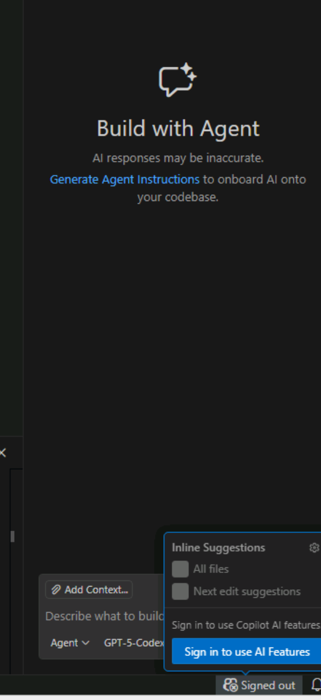
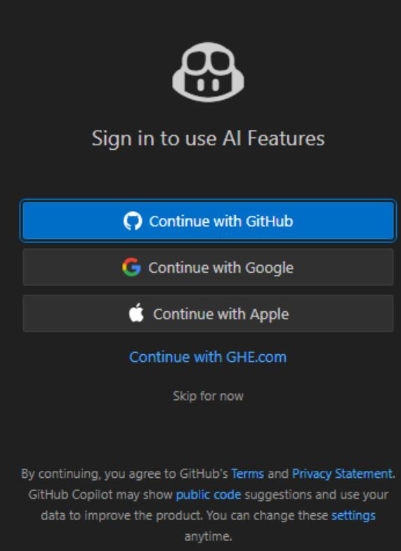
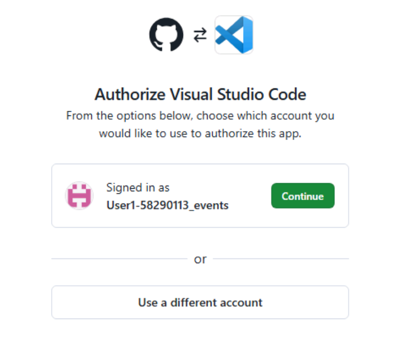
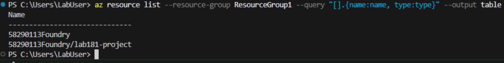

# Module 01 — Pre‑Requisites

Establish the tools and workspace needed for the Hello Weather lab before drafting any specs or plans.

## Phase Goals

- Confirm local tooling meets workshop requirements.
- Stand up a clean project workspace with an isolated Python environment.
- Bootstrap Spec Kit so later phases share a consistent agent grounding.

## Key Deliverables

- Fully patched workstation with required CLI tools and VS Code extensions.
- Activated virtual environment seeded with project dependencies.
- Spec Kit folder scaffold ready for prompts.

## System Requirements

*These are pre installed in the lab machine.*

- Windows 10/11
- Python 3.10+
- Git
- Azure CLI
- Visual Studio Code
- Install or confirm these extensions:
  - Python
  - Pylance
  - GitHub Copilot
  - GitHub Copilot Chat
  - Azure Tools (optional, but useful for portal interactions)

## Step 1: Sign in to Visual Studio Code

- In the Lab VM, Get the Subscription and User details for the instructions below, see below image for details.

  

- [ ] Open a browser
- [ ] Login at **<https://github.com/skillable-events>** with Azure Portal user credentials from the resource page (see above picture).
- [ ] Keep the logged-in browser tab open to keep your Github session active.
- [ ] Open Visual Studio Code.
- [ ] Use Github login option in VS Code to sign in if not signed in already.

  

- [ ] Select **Continue with Github**.

  

- [ ] Authenticate profile through SSO portal.

  

- [ ] You should be authenticated succesfully. Follow the browser prompts to complete authentication.

## Step 2 — Prepare VS Code

- [ ] Launch a new terminal in VS Code

  

- [ ] Execute the below commands in terminal

  ```bash
  python --version
  git --version
  az version
  ```

  The output would be **similar** to the below:

    
- [ ] Login to Azure using the AZ command in terminal

  ```powershell
  # Login to Azure - Use the credentials from above
  az login
  ```

- [ ] Ensure the below Visual Studio Code extensions are installed

  

## Step 3 — Create the Workspace Folder

- [ ] Create a folder under C:\Lab (eg., hello-weather-agent) by using the below command.

  ```bash
  mkdir hello-weather-agent
  cd hello-weather-agent
  ```

- [ ] Launch **Visual Studio Code** from this folder using the below command and click the checkbox and "Yes, I trust the authors"

  ```bash
  code . --reuse-window
  ```

## Step 4 — Create and Activate a Virtual Environment

- [ ] Open a terminal window (as needed) and run the below: *Ensure the path in the terminal window points to C:\Lab\hello-weather-agent*

  ```bash
  python -m venv .venv
  .venv\Scripts\activate
  ```

This will create the virtual environment. Leave the terminal window active for subsequent commands.

## Step 5 — Install Python Dependencies

- [ ] In the terminal window run the below command to install the required packages.

  ```bash
  pip install -U agent-framework --pre fastapi uvicorn jinja2 python-dotenv
  ```

  This will take a few minutes.

## Step 6 — Initialize Spec-Kit

- [ ] In the terminal window run the below to install the Spec Kit dependencies.

  ```bash
  uvx --from git+https://github.com/github/spec-kit.git specify init --here
  ```

  Select/type **Y** for the warning on overwriting existing files

- [ ] In the "Choose your AI Assitant" prompt, select copilot (Github Copilot).

  

- [ ] In the "Choose script type", select ps (PowerShell).

  

**You may see errors/warnings related to Git which can be ignored.**

- [ ] Open GitHub Copilot in Visual Studio Code, if not already open.

- [ ] Once opened, in the chat window ensure Agent mode is selected and then type:

  ```bash
  /speckit
  ```

- [ ] You should see the below SpecKit prompts. This confirms that the above installs completed successfully:

  

- [ ] Confirm the following directories appear:
  - [ ] speckit.constitution/
  - [ ] speckit.specify/
  - [ ] speckit.plan/
  - [ ] speckit.tasks/
  - [ ] speckit.implement/

- [ ] Ensure the **GPT-5-Codex(Preview)** model is selected as shown in the below image.

  
  
## Step 7 — Verify foundry resource and model in Azure
  
- [ ] Verify automated deployment of foundry resources, see expected results below.  

  ```powershell
  # List deployments in the resource group
  az resource list --resource-group ResourceGroup1 --query "[].{name:name, type:type}" --output table
  ```

  

## Human-in-the-Loop Disclaimer

- Treat every automation command here as guidance, not gospel: confirm versions, read the output, and rerun anything that looks suspicious before moving forward.
- **If a step misbehaves, recruit GitHub Copilot in chat to troubleshoot the script before asking a proctor—Copilot suggested these steps, so it should help clean up its own install party faster than a human can parse the logs.**
- Document any manual tweaks you make so later phases inherit the correct environment assumptions.

## Exit Criteria

- All commands above succeed without errors (unless noted to ignore).
- Spec Kit agents are visible.
- Your editor shows the Spec Kit prompt files with initial content.

## Congratulations

This module is now complete. Proceed to [02-constitution](../02-constitution/README.md) once these prerequisites are met.
