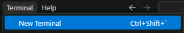
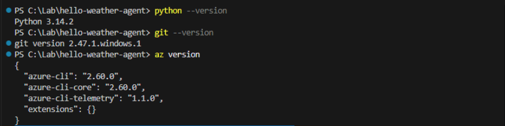
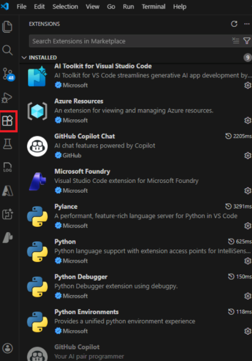
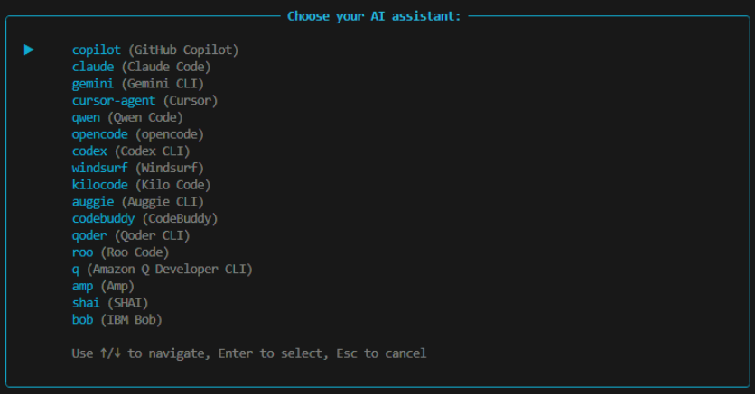
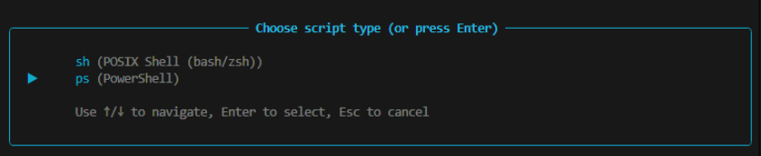
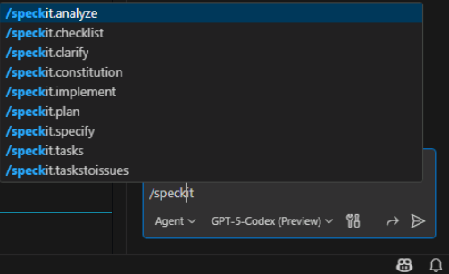
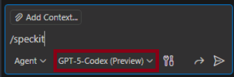
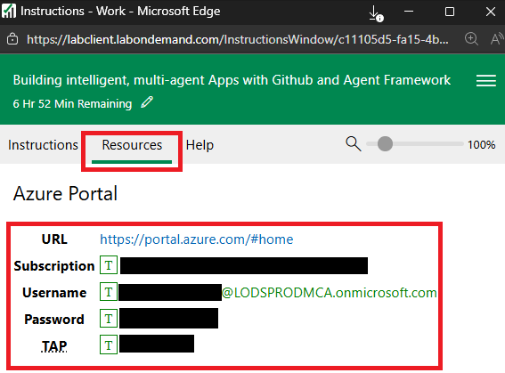

# Module 01 — Pre‑Requisites

Establish the tools and workspace needed for the Hello Weather lab before drafting any specs or plans.

## Phase Goals

- Confirm local tooling meets workshop requirements.
- Stand up a clean project workspace with an isolated Python environment.
- Bootstrap Spec Kit so later phases share a consistent agent grounding.

## Key Deliverables

- Fully patched workstation with required CLI tools and VS Code extensions.
- Activated virtual environment seeded with project dependencies.
- Spec Kit folder scaffold ready for prompts.

## System Requirements

*These are pre installed in the lab machine.*

- Windows 10/11
- Python 3.10+
- Git
- Azure CLI
- Visual Studio Code
- Install or confirm these extensions:
  - Python
  - Pylance
  - GitHub Copilot
  - GitHub Copilot Chat
  - Azure Tools (optional, but useful for portal interactions)

## Step 1: Run quick spot checks (Optional)

- [ ] Open Visual Studio Code
- [ ] Launch a new terminal in VS Code

  

- [ ] Execute the below commands in terminal

  ```bash
  python --version
  git --version
  az version
  ```

  The output would be **similar** to the below:

    

## Step 2 — Prepare VS Code

- [ ] Ensure the below Visual Studio Code extensions are installed

  

## Step 3 — Create the Workspace Folder

- [ ] In the terminal window in VS Code:
- [ ] Create a folder under C:\Lab (eg., hello-weather-agent) by using the below command.

  ```bash
  mkdir hello-weather-agent
  cd hello-weather-agent
  ```

- [ ] Launch **Visual Studio Code** from this folder using the below command and click the checkbox and "Yes, I trust the authors"

  ```bash
  code . --reuse-window
  ```

## Step 4 — Create and Activate a Virtual Environment

- [ ] Open a terminal window (as needed) and run the below: *Ensure the path in the terminal window points to C:\Lab\hello-weather-agent*

  ```bash
  python -m venv .venv
  .venv\Scripts\activate
  ```

This will create the virtual environment. Leave the terminal window active for subsequent commands.

## Step 5 — Install Python Dependencies

- [ ] In the terminal window run the below command to install the required packages.

  ```bash
  pip install -U agent-framework --pre fastapi uvicorn jinja2 python-dotenv
  ```

  This will take a few minutes.

## Step 6 — Initialize Spec-Kit

- [ ] In the terminal window run the below to install the Spec Kit dependencies.

  ```bash
  uvx --from git+https://github.com/github/spec-kit.git specify init --here
  ```

  Select/type **Y** for the warning on overwriting existing files

- [ ] In the "Choose your AI Assitant" prompt, select copilot (Github Copilot).

  

- [ ] In the "Choose script type", select ps (PowerShell).

  

**You may see errors/warnings related to Git which can be ignored.**

- [ ] Open GitHub Copilot in Visual Studio Code.
  
  [!CAUTION]
  > You may have to signin using an account with copilot capabilities.

- [ ] Once opened, In the chat window ensure Agent mode is selected and then type:

  ```bash
  /speckit
  ```

- [ ] You should see the below SpecKit prompts. This confirms that the above installs completed successfully:

  

- [ ] Confirm the following directories appear:
  - [ ] speckit.constitution/
  - [ ] speckit.specify/
  - [ ] speckit.plan/
  - [ ] speckit.tasks/
  - [ ] speckit.implement/

- [ ] Ensure Github Copilot is open and available.

- [ ] Ensure the **GPT-5-Codex(Preview)** model is selected as shown in the below image.

  
  
## Step 7 — Create Microsoft Foundry Resource and Deploy a Model (Optional)

- These resources should already be created in the lab vm. Skip this step if you are able to see those resources in the subscription. [REMOVE STEP ONCE ARM DEPLOYMENT IS CONFIRMED]

- In the Lab VM, Get the Subscription and User details for the instructions below, see below image for details.

  

- [ ] **Set up prerequisites**

  ```powershell
  # Login to Azure
  az login
  
  # Set your subscription. Use the resources section on the right hand <Image place holder>
  az account set --subscription "your-subscription-id"
  
  # Create a resource group
  az group create --name "rg-aifoundry-demo" --location "eastus"
  ```

- [ ] **Create Azure AI Foundry Hub and Project**

  ```powershell
  # Install the Azure ML extension
  az extension add --name ml
  
  # Create Azure AI Hub
  az ml workspace create `
    --kind hub `
    --resource-group "rg-aifoundry-demo" `
    --name "ai-hub-demo" `
    --location "eastus"
  
  # Create Azure AI Project (within the hub)
  az ml workspace create `
    --kind project `
    --resource-group "rg-aifoundry-demo" `
    --name "ai-project-demo" `
    --location "eastus" `
    --hub-id "/subscriptions/<subscription-id>/resourceGroups/rg-aifoundry-demo/providers/Microsoft.MachineLearningServices/workspaces/ai-hub-demo"
  ```

- [ ] **Deploy a Model**

  ```powershell
  # Deploy GPT-4o model (example)
  az ml online-deployment create `
    --resource-group "rg-aifoundry-demo" `
    --workspace-name "ai-project-demo" `
    --name "gpt-4o-deployment" `
    --model "azureai://registries/azureml/models/gpt-4o/versions/latest" `
    --instance-type "Standard_DS3_v2" `
    --instance-count 1
  ```

- [ ] **Verify Deployment**

  ```powershell
  # List deployments in the workspace
  az ml online-deployment list `
    --resource-group "rg-aifoundry-demo" `
    --workspace-name "ai-project-demo"
  ```

## Human-in-the-Loop Disclaimer

- Treat every automation command here as guidance, not gospel: confirm versions, read the output, and rerun anything that looks suspicious before moving forward.
- **If a step misbehaves, recruit GitHub Copilot in chat to troubleshoot the script before asking a proctor—Copilot suggested these steps, so it should help clean up its own install party faster than a human can parse the logs.**
- Document any manual tweaks you make so later phases inherit the correct environment assumptions.

## Exit Criteria

- All commands above succeed without errors (unless noted to ignore).
- Spec Kit agents are visible.
- Your editor shows the Spec Kit prompt files with initial content.

## Congratulations

This module is now complete. Proceed to [02-constitution](../02-constitution/README.md) once these prerequisites are met.
