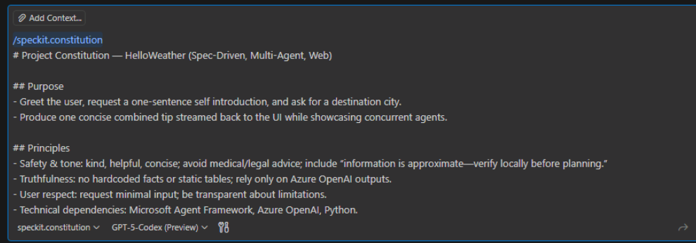
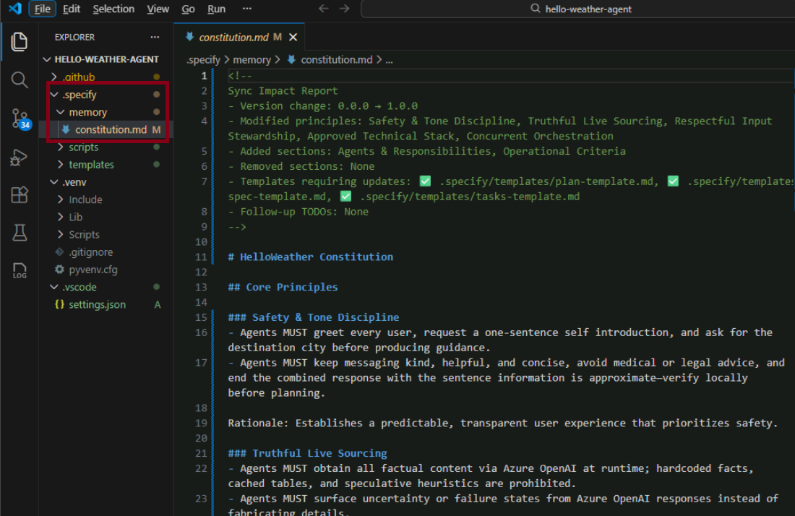

# Module 02 — Constitution

## Constitution Overview

In GitHub Spec Kit, the constitution defines the guardrails that every agent must follow. It sets product intent, user tone, data boundaries, and fallback behaviors so downstream prompts, plans, and tasks inherit consistent guidance. Treat it as the contract between your multi-agent system and the real-world constraints of the lab.

## Constitution Contents

- Project purpose and target user experience.
- Authoritative data sources and forbidden inputs (e.g., no static datasets, Azure OpenAI only).
- Tone, style, and compliance requirements such as disclaimers.
- Agent-level responsibilities, concurrency rules, and failure handling.
- Non-goals that clarify what the solution will not attempt.

## Step 1: Generate the Constitution with GitHub Copilot

- [ ] In the VS Code window, opened previously, ensure the terminal root is `hello-weather-agent` in the Terminal console.

    

- [ ] Open the Copilot Chat panel (sidebar icon or `Ctrl+Shift+I`).
- [ ] In the chat input, paste the placeholder prompt below (it includes the `/speckit.constitution` command) and edit it with project specifics.
- [ ] Hit **Enter** in Github Copilot to draft a constitution markdown file.

    

### Copilot Prompt Template (Copy/Paste in Copilot)

```text
/speckit.constitution
# Project Constitution — HelloWeather (Spec-Driven, Multi-Agent, Web)

## Purpose
- Greet the user, request a one-sentence self introduction, and ask for a destination city.
- Produce one concise combined tip streamed back to the UI while showcasing concurrent agents.

## Principles
- Safety & tone: kind, helpful, concise; avoid medical/legal advice; include “information is approximate—verify locally before planning.”
- Truthfulness: no hardcoded facts or static tables; rely only on Azure OpenAI outputs.
- User respect: request minimal input; be transparent about limitations.
- Technical dependencies: Microsoft Agent Framework, Azure OpenAI, Python.
- Orchestration: use ConcurrentBuilder, stream per-agent updates, and merge outputs gracefully.

## Agents
- WeatherAgent: 1–2 sentence approximate weather tip using Azure OpenAI only.
- CityAgent: one sentence of city guidance (transit/safety/local insight) using Azure OpenAI only.

## Success Criteria
- Parallel execution with visible streaming.
- Final response under ~60 words.
- Graceful degradation if one agent fails.

## Non-Goals
- Real-time meteorological accuracy or external API integration.
- Multi-paragraph outputs.
```

You will required to click on "Keep"/"Allow"/"Continue" in the chat window to as copilot works.

## Step 2: After Generating the Constitution

- [ ] The generated file appears in `.specify/memory/constitution.md`.

    

- [ ] Verify tone, success criteria, and non-goals accurately mirror stakeholder expectations.
- [ ] Confirm no unintended dependencies or forbidden data sources slipped in.
- [ ] Review fallback and safety language for alignment with internal policies.
- [ ] Update any section that requires clarification or tighter constraints before committing.
- [ ] Compare your draft with the sample reference below.

## Human-in-the-Loop Disclaimer

- Treat the generated constitution as a negotiation draft: tighten language, align with policy, and record the final wording only after human review.
- **If any clause feels off, ask GitHub Copilot in chat to redraft the section before escalating—Copilot wrote the first draft, so it should be able to lawyer itself faster than explaining the loophole to your instructor.**
- Keep a change revision log so downstream phases understand which guardrails changed and why.

## Congratulations

This module is now complete. Proceed to [03-specification](../03-specification/README.md) once the above steps are complete.

## Appendix - Sample Constitution Reference (Do Not Copy)
>
> *Based on the HelloWeather implementation in [07-WorkingCode](https://github.com/Azure-Samples/TechConnect-2026-LAB-1073-Building-intelligent-multi-agent-Apps-with-GH-Speckit-and-Agent-Framework). Treat as inspiration only.*
>
> ### Core Principles
>
> - **Safety and tone assurance**: Keep responses kind, helpful, and concise. Avoid medical or legal advice and always append "information is approximate—verify locally before planning."
> - **Truthful Azure-sourced guidance**: WeatherAgent and CityAgent must rely only on Azure OpenAI reasoning. No hardcoded facts, cached tables, or external APIs.
> - **Respectful input transparency**: Collect only a one-sentence self introduction and a city once per session. Explain limitations before delivering guidance.
> - **Microsoft Agent Framework discipline**: Implement agent logic in Python using Microsoft Agent Framework with Azure OpenAI models provisioned through Microsoft Foundry. Do not add > unmanaged AI dependencies.
> - **Concurrent orchestration fidelity**: Run WeatherAgent and CityAgent in parallel via ConcurrentBuilder, stream progress, merge results, enforce the sub-60-word response, and add a > polite note when an agent fails.
>
> ### Purpose and Experience Contract
>
> - Deliver a friendly HelloWeather greeting that elicits the intro and city.
> - Return one combined tip blending weather and city guidance with the required disclaimer.
> - Showcase parallel agent execution and streaming aggregation to the end user.
>
> ### Agent Roles and Delivery Criteria
>
> - **WeatherAgent**: Produce a one to two sentence approximate weather tip for the chosen city using Azure OpenAI only.
> - **CityAgent**: Produce one concise sentence of city guidance (transit, neighborhood, timing, or safety) using Azure OpenAI only.
> - **Aggregator**: Stream intermediate updates, consolidate them into a single concise message, remove duplication, and flag degraded output with a courteous notice.
> - **Success criteria**: Parallel execution with streaming, graceful degradation on agent failure, final response below roughly 60 words including greeting, insight, and disclaimer.
> - **Non-goals**: Real-time meteorological accuracy, geolocation, or integration with external weather or city services.
>
> ### Governance
>
> This constitution acts as the authoritative contract for HelloWeather delivery. Plans, specs, tasks, and code reviews must demonstrate compliance, confirming the disclaimer, concurrency > pattern, dependency boundaries, and absence of hardcoded data. Amendments require maintainer consensus, an impact assessment on active work, and synchronized template updates. Use > semantic versioning (MAJOR for breaking changes, MINOR for new principles, PATCH for clarifications). Run compliance reviews before merging any change to keep principles verifiable > through tests and runtime instrumentation.
>
> **Version**: *Update with your release number* | **Ratified**: *YYYY-MM-DD* | **Last Amended**: *YYYY-MM-DD*
