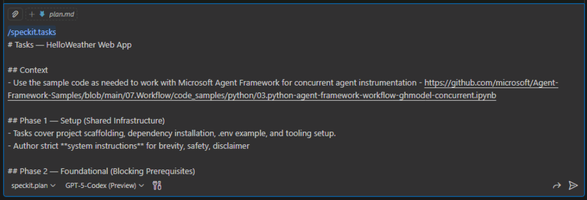
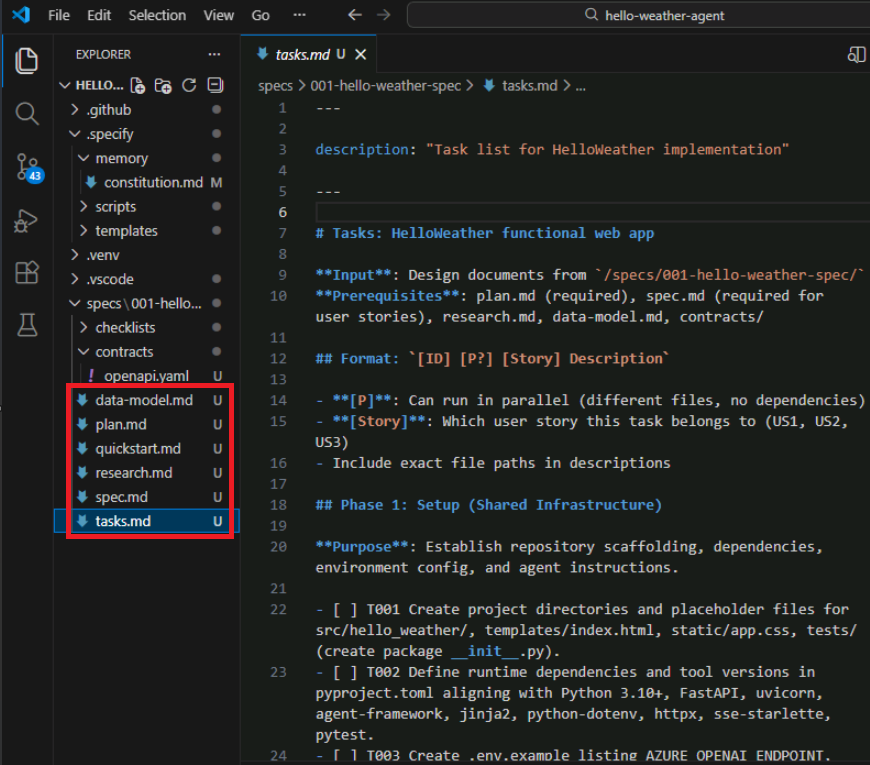

# Module 05 — Tasks

## Tasks Overview

In GitHub Spec Kit, the `/speckit.tasks` phase turns the plan into ordered, testable work items grouped by user story. Each task should be granular enough to implement and validate independently while preserving the constitution’s guardrails.

## Task Contents

- Story-aligned task lists with clear sequencing and optional parallel flags.
- Path references that mirror the plan’s project layout.
- Testing instructions when a story demands verification.
- Dependencies and checkpoints so teams can slice delivery per story.

## Step 1: Generate Tasks with GitHub Copilot

- [ ] In the VS Code - Goto the Copilot Chat panel (sidebar icon or `Ctrl+Shift+I`).
- [ ] Paste the prompt template below (it also includes `/speckit.tasks`).
- [ ] Hit **Enter** in Github Copilot to draft `tasks.md`.

    

### Copilot Prompt Template (Copy/Paste in Copilot)

```text
/speckit.tasks
# Tasks — HelloWeather Web App

## Context
- Use the sample code as needed to work with Microsoft Agent Framework for concurrent agent instrumentation - https://github.com/microsoft/Agent-Framework-Samples/blob/main/07.Workflow/code_samples/python/03.python-agent-framework-workflow-ghmodel-concurrent.ipynb

## Phase 1 — Setup (Shared Infrastructure)
- Tasks cover project scaffolding, dependency installation, .env example, and tooling setup.
- Author strict **system instructions** for brevity, safety, disclaimer

## Phase 2 — Foundational (Blocking Prerequisites)
- Tasks create models, validators, telemetry helpers, orchestration skeleton, and placeholder FastAPI routes.

## Phase 3 — User Story 1 (Collect Friendly Inputs, Priority P1)
- Tasks implement HTML form, GET/POST handlers, disclaimer banner, initial SSE event, and validator unit tests.

## Phase 4 — User Story 2 (Watch Agents Stream, Priority P2)
- Tasks build MockLLM fixtures, integration tests, WeatherAgent and CityAgent prompts, ConcurrentBuilder wiring, SSE streaming loop, heartbeat handling, and telemetry logging.

## Phase 5 — User Story 3 (Receive Combined Tip, Priority P3)
- Tasks add contract tests, final aggregation logic, degraded-note handling, final SSE event, and word-count guard.

## Phase 6 — Polish & Cross-Cutting
- Tasks document setup/demo steps, add CLI tips, extend telemetry tests, and perform manual validation with live credentials.

## Dependencies & Parallelism
- List each phase in order with checkpoints.
- Mark tasks that can run in parallel with [P].
- Include user story dependency graph and examples of safe parallel execution.

## Implementation Strategy
- Summarize how to deliver MVP (Phases 1–3), deepen functionality (Phases 4–5), and polish (Phase 6).
```

You will required to click on "Keep"/"Allow"/"Continue" in the chat window to as copilot works.

## Step 2: After Generating Tasks

- [ ] The generated file appears in `specs\001-hello-weather-app/tasks.md`; look in VSCode Explorer for the specific file.

    

- [ ] Confirm tasks stay aligned with user stories from `spec.md` and milestones in `plan.md`.
- [ ] Ensure no task introduces static data, external APIs, or other constitution violations.
- [ ] Check that parallel indicators `[P]` only mark work that truly has no conflicts.
- [ ] Verify testing sections match the planned strategy (unit/contract/integration/manual).
- [ ] Adjust descriptions to highlight ownership or additional notes your team needs.

## Human-in-the-Loop Disclaimer

- Scrutinize each generated task to confirm prerequisites, owners, and test notes are realistic before putting them on a board.
- **If a task feels unclear, ask GitHub Copilot to tighten or split it before pinging the proctor—Copilot drafted the checklist, so it should untangle its own TODO spaghetti faster than a human can guess what T042 means.**
- Capture any manual edits so future iterations know which tasks were reworded, merged, or dropped.

## Congratulations

This module is now complete. Proceed to [06-implementation](../06-implementation/README.md) once the above steps are complete.

## Appendix - Sample Task Structure (Do Not Copy)
>
> Adapted from 07-WorkingCode/specs/001-hello-weather-app/tasks.md. Update IDs, file paths, and wording to reflect your plan.

### Phase 1 — Setup

- [ ] T001 Create project scaffold, virtual environment, and base FastAPI entrypoint.
- [ ] T002 Add `.env.example` with Azure OpenAI variables and document disclaimer constant.

### Phase 2 — Foundational

- [ ] T005 Build validators to confirm one-sentence intro and city detection.
- [ ] T008 Prepare ConcurrentBuilder workflow and streaming pipeline with placeholders.

### Phase 3 — User Story 1 (Collect Intro + City)

- [ ] T011 Implement HTML form and disclaimer banner in `templates/index.html`.
- [ ] T013 Integrate validators into POST handler and return friendly errors for invalid input.
- [ ] T015 Add unit tests for sentence + city validation.

### Phase 4 — User Story 2 (Stream Agent Updates)

- [ ] T018 Implement WeatherAgent prompt using Azure OpenAI only.
- [ ] T021 Wire SSE streaming loop so both agents surface updates in real time.
- [ ] T022 Handle polite waiting notes when one agent lags.

### Phase 5 — User Story 3 (Aggregate Final Tip)

- [ ] T026 Combine agent outputs, cap to ~60 words, and append disclaimer.
- [ ] T027 Insert degraded-agent note when any agent fails.
- [ ] T024 Add contract test for final aggregated message.

### Phase 6 — Polish

- [ ] T030 Refresh README with setup steps and streaming demo notes.
- [ ] T033 Run manual check with real credentials to verify no static data usage.

### Dependencies & Parallelism

- Follow the phase order (Setup → Foundational → US1 → US2 → US3 → Polish).
- Only start US2 tasks after US1 validations are in place.
- Parallel tasks are marked `[P]` where safe (e.g., doc updates vs. code changes).
