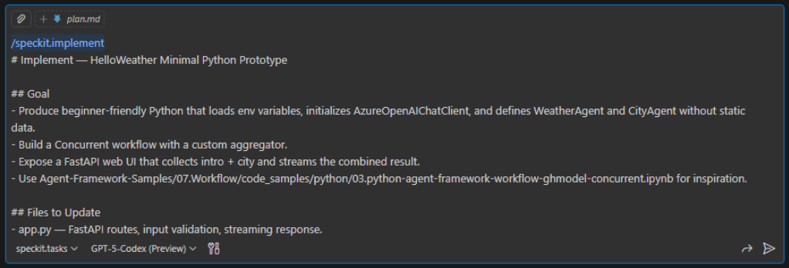
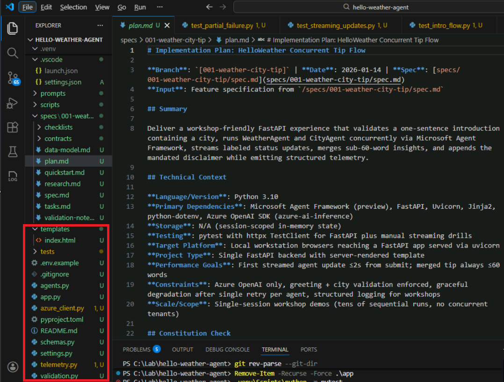
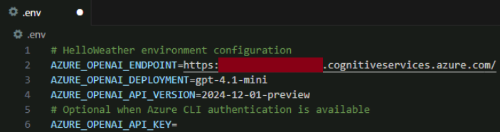

# Module 06 — Implementation

## Implementation Overview

In GitHub Spec Kit, the implementation phase turns the plan and tasks into working code. The goal is to produce a minimal, readable solution that demonstrates the feature while honoring every constitutional guardrail.

## Implementation Contents

- Source files updated or created during `/speckit.implement`.
- Guidance for agents, orchestrators, and FastAPI endpoints.
- Streaming and aggregation patterns, including fallback behavior.
- Run instructions, logging, and manual validation tips.
- Links to reference implementations for further study.

## Step 1: Generate the Implementation with GitHub Copilot

- [ ] In the VS Code, goto Copilot Chat panel (sidebar icon or `Ctrl+Shift+I`).
- [ ] Paste the prompt template below (it also includes `/speckit.implement`).
- [ ] Hit **Enter** in Github Copilot to generate the actual code for the application.

    

### Copilot Prompt Template (Copy/Paste in Copilot)

```text
/speckit.implement
# Implement — HelloWeather Minimal Python Prototype

## Goal
- Produce beginner-friendly Python that loads env variables, initializes AzureOpenAIChatClient, and defines WeatherAgent and CityAgent without static data.
- Build a Concurrent workflow with a custom aggregator.
- Expose a FastAPI web UI that collects intro + city and streams the combined result.
- Use Agent-Framework-Samples/07.Workflow/code_samples/python/03.python-agent-framework-workflow-ghmodel-concurrent.ipynb for inspiration.

## Files to Update
- app.py — FastAPI routes, input validation, streaming response.
- agents.py — Azure client init, agent definitions, ConcurrentBuilder orchestration, aggregator helpers.
- templates/index.html — simple form for intro + city plus streaming output area.
- .env (or .env.example) and README.md — runtime configuration and quickstart notes.

## Dependencies & Auth
- Packages: agent-framework --pre, fastapi, uvicorn, jinja2, python-dotenv.
- Default auth via AzureCliCredential with API key fallback.
- Environment vars: AZURE_OPENAI_ENDPOINT, AZURE_OPENAI_DEPLOYMENT, AZURE_OPENAI_API_VERSION, optional AZURE_OPENAI_API_KEY.

## Agent Instructions (System Prompts)
- WeatherAgent: "Given a city name, return a 1-2 sentence approximate weather tip (likely conditions, comfort or packing guidance). Use only Azure OpenAI model knowledge. Do not use static data or external APIs. Friendly and concise."
- CityAgent: "Given a city name, return one short guidance sentence (transit, neighborhood, timing, or safety). Use only Azure OpenAI model knowledge. No static data. Friendly and concise."

## Orchestration & Streaming
- Use ConcurrentBuilder with both agents as participants and drive it through run_stream.
- Implement a custom aggregator that merges agent text into a compact paragraph (≤ ~60 words), deduplicates overlap, and appends "Information is approximate—verify locally before planning."

## Web Frontend
- GET / renders index.html with inputs for intro and city plus disclaimer banner.
- POST /predict validates inputs, launches the concurrent workflow, and streams status events and the final message (SSE or chunked response).

## Resilience & Observability
- Add timeouts and a single retry per agent; if one fails, return the other agent’s output with a polite note.
- Sanitize inputs, cap output length, avoid medical/legal advice.
- Log per-agent latency, errors, and aggregation outcomes.

## Run Instructions
- Include inline comments explaining client initialization, agent creation, concurrency wiring, streaming loop, and aggregation.
- Provide steps to run locally: `uvicorn app:app --reload`.
- Mention any quick manual tests (valid intro + city, missing city, simulated agent failure).

## Style Notes
- Keep functions short, explicit, and well commented for workshop participants.
- Avoid unused abstractions or premature optimizations; focus on clarity.
```

You will be required to click on "Keep"/"Allow"/"Continue" in the chat window to as copilot works.

## Step 2: After Generating the Implementation

### Step 2.1: Output Check

- [ ] Confirm the following files exist and align with the expectations below:
  - [ ] app.py — FastAPI entrypoint with GET/POST routes and streaming response helpers; verify the POST handler validates inputs and streams the aggregator output.
  - [ ] agents.py — Agent-framework bootstrap plus ConcurrentBuilder wiring; inspect aggregation logic and fallback handling for failures.
  - [ ] templates/index.html — Workshop-friendly HTML form with intro and city fields; check the streaming output container renders incremental updates.
  - [ ] .env or .env.example — Contains the Azure OpenAI settings; ensure no secrets are committed and that placeholder values match your deployment names.
  - [ ] README.md (project root) — Updated quickstart mirroring the configuration and run steps in this phase.
  
      

### Step 2.2: Execute the application

*Perform below 3 instructions if only venv is not available.*

- [ ] (optional) In VS Code, choose Terminal > New Terminal or press Ctrl+` to open an integrated shell.
- [ ] (optional) Activate the virtual environment if needed: `.\.venv\Scripts\Activate.ps1` (PowerShell).
- [ ] (optional) Install dependencies: `pip install -r requirements.txt`.

[!CAUTION]
> Please note that you may see occasionally compilation errors or execution errors as code is generated by AI. Read the [Guidance](#human-in-the-loop-disclaimer).

- [ ] Create or modify the .env file to update using your openai deployment details

    

- [ ] Run the app: `.venv\Scripts\uvicorn app:app --log-level debug`.
- [ ] Open <http://127.0.0.1:8000> in a browser, enter a friendly intro and a city, then submit; confirm streamed content appears and ends with the disclaimer. Example - *I am Dennis from Austin, Texas, USA.*

    

### Step 2.3: Validations

*Fully optional, only do it if you are a code freak.*

- [ ] Test validation by submitting an empty city and confirm the form shows a helpful error. Example - *I am Dennis.*
- [ ] Trigger a degraded path by raising an exception inside one agent (temporary change) and verify the other agent’s message plus polite fallback displays. *This requires code change, so we will leave you to your imagination*

### Step 2.4: Exit

- [ ] Return to the terminal and press Ctrl+C to stop Uvicorn when you finish.

## Human-in-the-Loop Disclaimer

- Treat every AI-generated artifact as a draft: read it, edit it, and run tests before trusting it anywhere near production.
- **If something breaks, recruit GitHub Copilot in chat to triage and suggest fixes before paging a proctor or instructor—after all, Copilot wrote the code, so it should fix its own mess faster than it can explain itself to a human.**
- Keep responsibility squarely with you: review security, compliance, and data handling, and document any manual changes you make.

## Congratulations

!!! Congratulations! Labs are now complete !!!

## Appendix - Sample Implementation Reference (Do Not Copy)

- FastAPI entrypoint and streaming route in [hello-weather-lab/07-WorkingCode/app.py](hello-weather-lab/07-WorkingCode/app.py).
- Agent definitions, concurrent workflow, and aggregator helpers in [hello-weather-lab/07-WorkingCode/agents.py](hello-weather-lab/07-WorkingCode/agents.py).
- Workshop-friendly HTML form and streamed output area in [hello-weather-lab/07-WorkingCode/templates/index.html](hello-weather-lab/07-WorkingCode/templates/index.html).
- Environment configuration sample in [hello-weather-lab/07-WorkingCode/.env](hello-weather-lab/07-WorkingCode/.env) (replace with your own secrets).
